# 🗑️ Abfall-Karte (Trash Card Plus)

Eine Lovelace-Karte für Home Assistant, die dir die nächsten **Müllabfuhr-Termine aus deinem
Kalender** anzeigt – und bei der **jede Abfallart ihr eigenes Design** bekommen kann:
eigene Farben, Transparenz, Hintergrund, Rahmen, Symbolform und Hervorhebung. Alles über
einen aufgeräumten visuellen Editor, ganz ohne YAML.

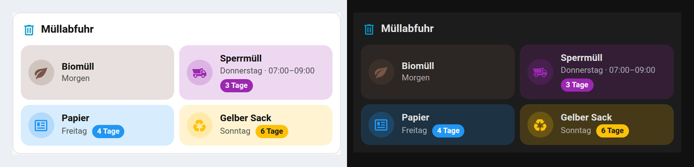

> Basiert auf der großartigen [TrashCard](https://github.com/idaho/hassio-trash-card) von
> [@idaho](https://github.com/idaho). Die Kalender-Logik wurde übernommen, Darstellung und
> Editor sind komplett neu geschrieben.

## ✨ Features

- **Jede Abfallart individuell gestaltbar** – Hintergrund (Theme, Farbton, Vollfarbe, eigene Farbe, transparent),
  Deckkraft-Regler, Farbverlauf, Symbolfarbe, Symbol-Hintergrund und -Form, Textfarbe, Rahmen, Schatten, Hervorhebung.
  Alles, was du nicht überschreibst, kommt aus dem gemeinsamen Standard-Design.
- **Transparenz & Glas-Effekt** – Deckkraft-Regler für Einträge und die umgebende Karte, dazu Unschärfe (Backdrop-Blur).
- **Einfaches Datumsformat** – statt kryptischer Formatcodes wählst du aus einer Liste mit echten Beispielen
  („Do., 01.10.“, „Donnerstag, 1. Oktober“, „in 3 Tagen“ …) oder baust dein Format per Dropdowns zusammen.
  Eine Live-Vorschau zeigt sofort, wie Heute/Morgen/in 5 Tagen aussehen.
- **4 Layouts**: Kacheln (Symbol links oder oben), Liste, Chips, Symbole mit Countdown
- **Countdown-Badge** („3 Tage“) oder Countdown als eigene Zeile
- **Hervorhebung** für heute (oder heute + morgen): Leuchten, Pulsieren, farbiger Rahmen oder etwas größer –
  spätere Termine optional blasser
- **Editor mit Tabs** (Kalender · Anzeige · Datum · Design · Abfallarten) und Live-Vorschau jeder Abfallart
- **„Gefundene Termine im Kalender“** – der Editor zeigt, welche Kalendereinträge er erkennt, und legt nicht
  erkannte Termine (z. B. „Schadstoffmobil“) mit einem Klick als neue Abfallart an
- **Mehrere Suchbegriffe** pro Abfallart („rest, grau“)
- **Auffang-Abfallart** für alles, was keinem Begriff entspricht – zeigt dann den echten Kalendertitel
- Deutsch & Englisch, helles und dunkles Theme, Sections-Dashboard
- Übernimmt YAML-Konfigurationen der Original-TrashCard (`pattern:` wird automatisch umgewandelt)

## 🖼️ Beispiele

| | |
|---|---|
| **Kräftig** – Vollfarbe mit Verlauf, Symbol oben, Pulsieren | **Jede Abfallart anders** |
| 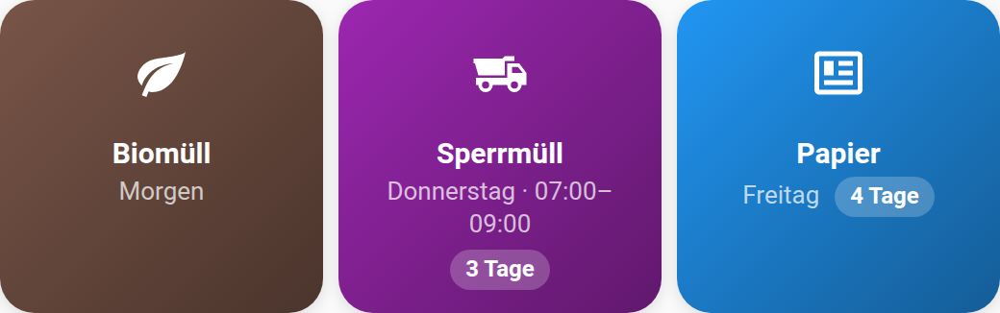 | 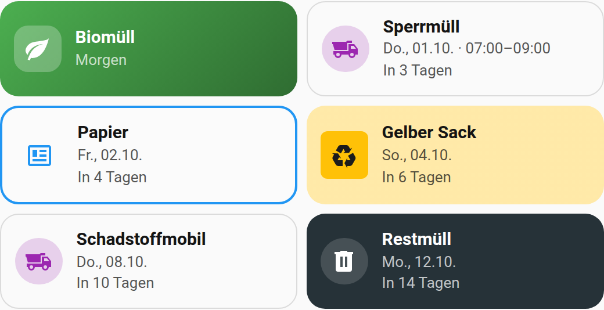 |
| **Liste** in einer Karte | **Chips** |
| 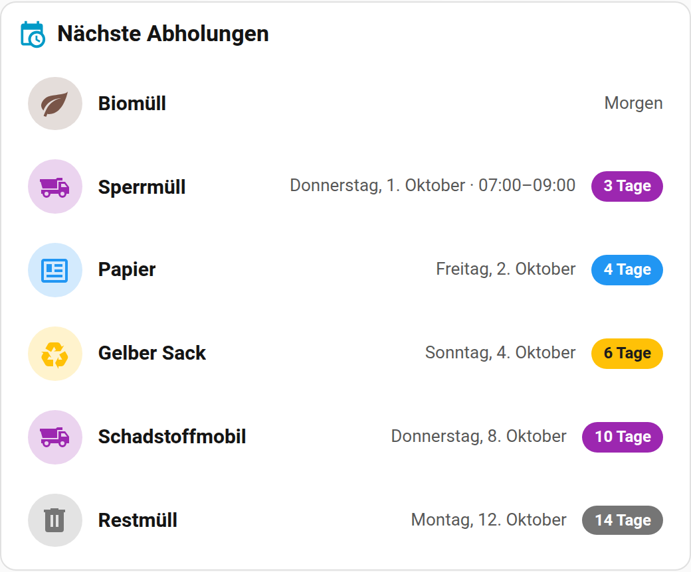 | 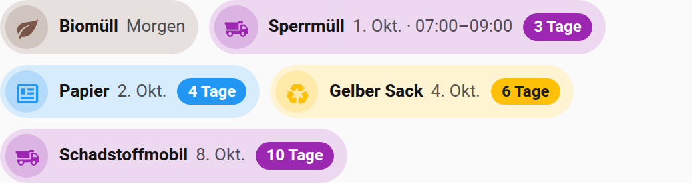 |
| **Symbole** mit Countdown | **Dunkles Theme** |
| 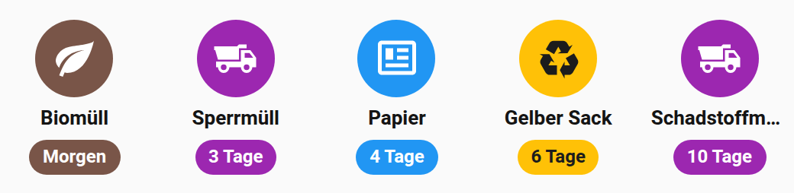 | 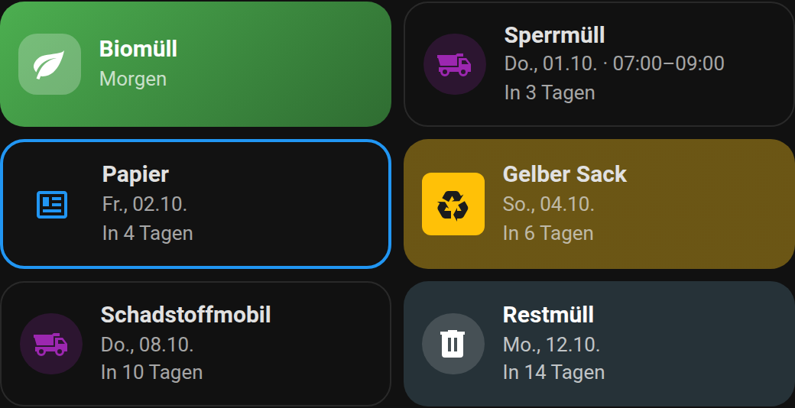 |

## 🎛️ Der Editor

| Datum – mit Live-Vorschau | Design – Standard für alle Abfallarten |
|---|---|
| 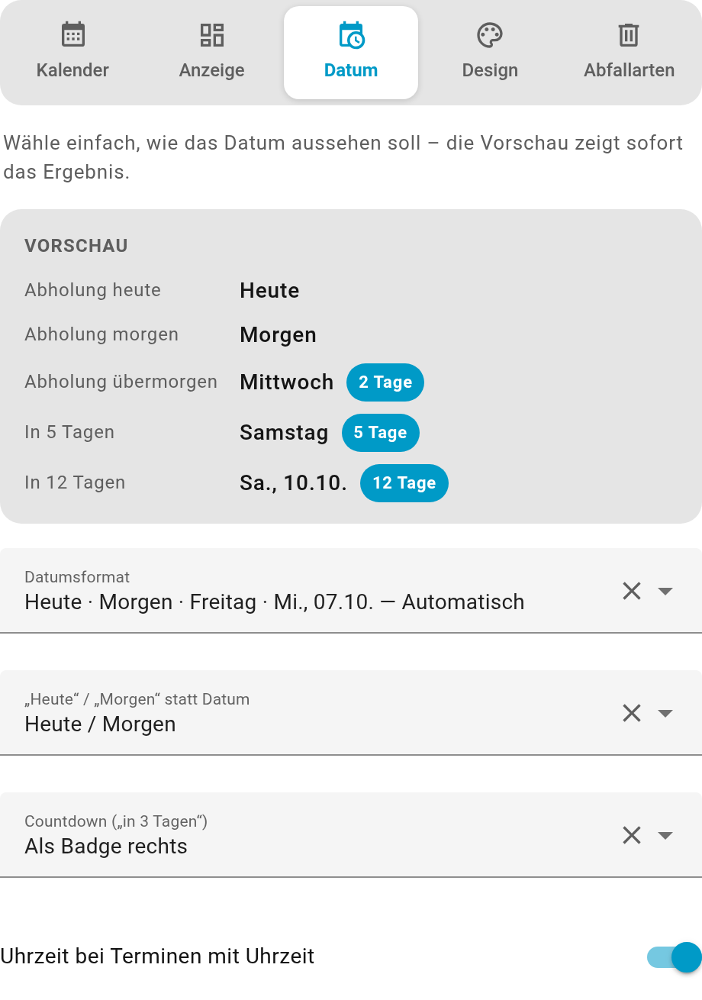 | 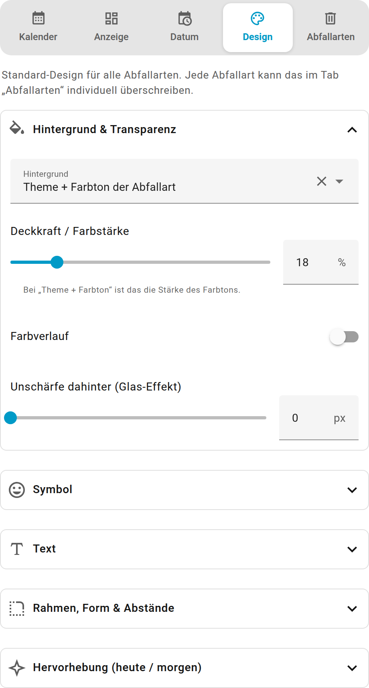 |
| **Abfallarten** – inkl. gefundener Kalendertermine | **Eine Abfallart bearbeiten** – mit eigener Vorschau |
| 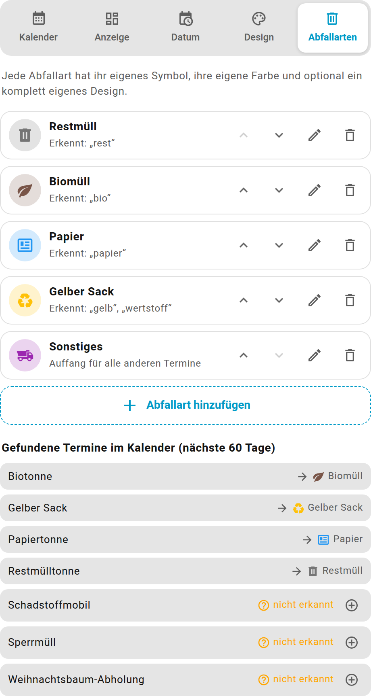 | 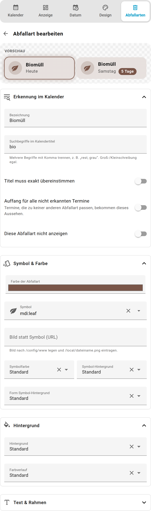 |

## 📦 Installation

### Über HACS (empfohlen)

Die Karte ist (noch) nicht im offiziellen HACS-Store gelistet, kann aber als
**benutzerdefiniertes Repository** hinzugefügt werden:

1. HACS öffnen → **⋮** (oben rechts) → **Benutzerdefinierte Repositories**
2. Repository-URL: `https://github.com/Kohle93/Trash-Card-Plus`
3. Typ: **Dashboard**
4. **Hinzufügen** → Karte in der Liste suchen → **Herunterladen**
5. Browser neu laden (ggf. Cache leeren)

### Manuell

1. [`trash-card-plus.js`](trash-card-plus.js) herunterladen und nach `/config/www/` kopieren
2. Einstellungen → Dashboards → ⋮ → **Ressourcen** → Ressource hinzufügen
   - URL: `/local/trash-card-plus.js`
   - Typ: **JavaScript-Modul**
3. Browser neu laden

## 🧩 Voraussetzung: Kalender

Die Termine kommen aus einer beliebigen **Kalender-Entität** – z. B. dem
[lokalen Kalender](https://www.home-assistant.io/integrations/local_calendar/), einem
ICS-/CalDAV-Kalender oder der [Waste Collection Schedule](https://github.com/mampfes/hacs_waste_collection_schedule)-Integration.
Der Titel des Termins (z. B. „Restmülltonne“) wird mit den Suchbegriffen deiner Abfallarten verglichen.

## ⚙️ Verwendung

Dashboard bearbeiten → **Karte hinzufügen** → **Abfall-Karte (Trash Card Plus)**. Die Karte sucht
sich automatisch einen passenden Kalender und bringt Standard-Abfallarten mit (Restmüll, Biomüll,
Papier, Gelber Sack, Sonstiges). Solange noch keine Termine da sind, zeigt die Vorschau Beispieltermine,
damit du das Design direkt einstellen kannst.

### Minimal

```yaml
type: custom:trash-card-plus
entities:
  - calendar.mullabfuhr
```

### Kräftige Kacheln mit Verlauf

```yaml
type: custom:trash-card-plus
entities:
  - calendar.mullabfuhr
orientation: vertical
columns: 3
max_items: 3
bg_mode: accent
bg_opacity: 100
bg_gradient: true
icon_bg_mode: none
icon_size: 30
highlight: pulse
highlight_days: 1
```

### Glas-Karte mit Liste

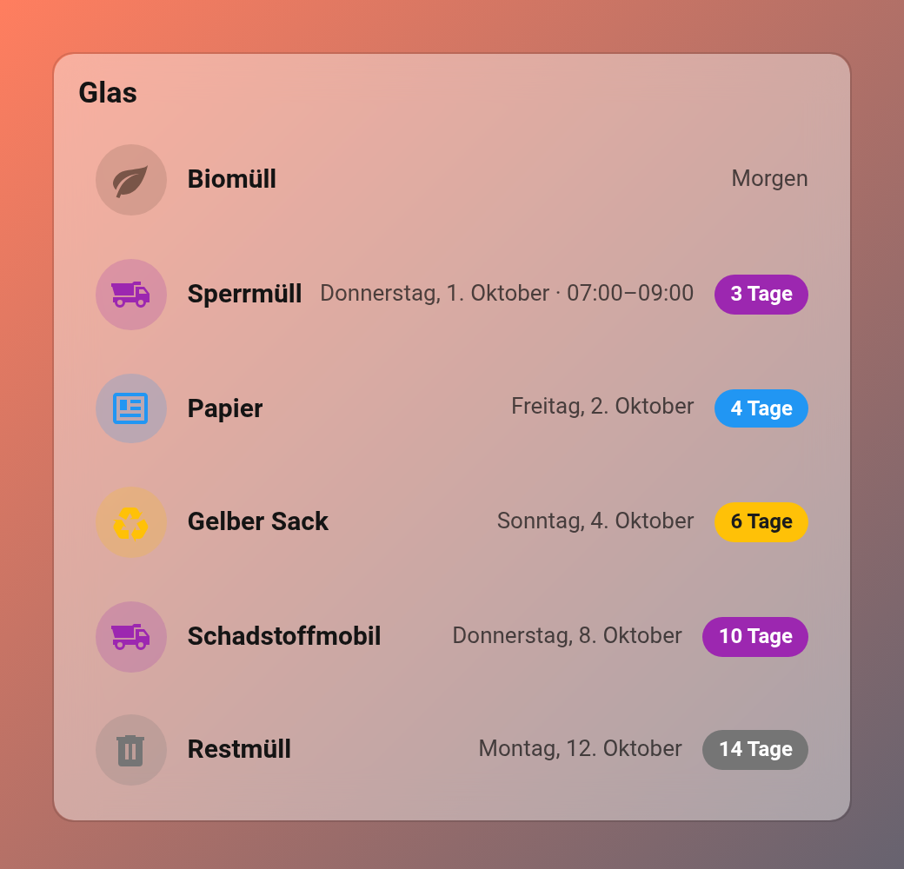

```yaml
type: custom:trash-card-plus
entities:
  - calendar.mullabfuhr
layout: list
container: card
title: Müllabfuhr
title_icon: mdi:trash-can-outline
container_bg_opacity: 40
container_blur: 12
bg_mode: none
shadow: none
date_format: weekday_long_date
```

### Jede Abfallart mit eigenem Design

```yaml
type: custom:trash-card-plus
entities:
  - calendar.mullabfuhr
columns: 2
countdown: line
items:
  - label: Restmüll
    pattern: rest, grau
    icon: mdi:trash-can
    color: [97, 97, 97]
    bg_mode: custom
    bg_color: [38, 50, 56]
    bg_opacity: 100
  - label: Biomüll
    pattern: bio
    icon: mdi:leaf
    color: [76, 175, 80]
    bg_mode: accent
    bg_opacity: 100
    bg_gradient: true
    icon_shape: rounded
    highlight: pulse
  - label: Papier
    pattern: papier, blau
    icon: mdi:newspaper-variant-outline
    color: [33, 150, 243]
    bg_mode: theme
    border_mode: accent
    border_width: 2
  - label: Gelber Sack
    pattern: gelb, wertstoff
    icon: mdi:recycle
    color: "#ffc107"
    bg_opacity: 35
  - label: Sonstiges
    icon: mdi:dump-truck
    color: purple
    fallback: true
```

## 📖 Alle Optionen

Alles lässt sich im Editor einstellen – die Tabelle ist nur zum Nachschlagen.

### Kalender

| Option | Standard | Beschreibung |
|---|---|---|
| `entities` | – | Liste von Kalender-Entitäten |
| `next_days` | `14` | So viele Tage in die Zukunft schauen |
| `max_items` | alle | Maximale Anzahl Einträge |
| `event_grouping` | `true` | Nur den nächsten Termin je Abfallart zeigen |
| `filter_events` | `false` | Nur erkannte Abfallarten zeigen (keinen Auffang) |
| `only_all_day_events` | `false` | Termine mit Uhrzeit ignorieren |
| `location` | – | Nur Termine, deren Ort diesen Text enthält |
| `drop_todayevents_from` | `10:00:00` | Ab dieser Uhrzeit verschwinden heutige ganztägige Termine |
| `refresh_rate` | `60` | Kalender alle x Minuten neu laden |
| `hide_when_empty` | `true` | Karte ausblenden, wenn nichts ansteht (sonst `empty_text`) |

### Anzeige

| Option | Standard | Werte |
|---|---|---|
| `layout` | `tiles` | `tiles`, `list`, `chips`, `icons` |
| `orientation` | `horizontal` | `horizontal`, `vertical` (nur Kacheln) |
| `columns` | `2` | Spalten bei Kacheln/Symbolen |
| `alignment` | `left` | `left`, `center`, `right`, `space` (Chips) |
| `show_label` / `use_summary` | `true` / `false` | Bezeichnung zeigen / Kalendertitel statt Bezeichnung |
| `container` | `none` | `none` (einzelne Einträge) oder `card` (eine gemeinsame Karte) |
| `title`, `title_icon` | – | Titel der Karte |
| `container_bg_mode` | `theme` | `theme`, `custom`, `none` |
| `container_bg_color`, `container_bg_opacity`, `container_blur` | – / `100` / `0` | Farbe, Deckkraft (%), Unschärfe (px) |
| `tap_action` | `more-info` | Beliebige HA-Aktion |

### Datum

| Option | Standard | Werte |
|---|---|---|
| `date_format` | `smart` | `smart`, `weekday_date`, `weekday_long_date`, `date_short`, `date_numeric`, `date_medium`, `date_long`, `weekday_long`, `weekday_short`, `countdown`, `weekday_countdown`, `custom` |
| `df_weekday` / `df_day` / `df_month` / `df_year` | `short` / `2-digit` / `2-digit` / `none` | Baukasten für `custom` (`none`, `short`, `long`, `numeric`, `2-digit`) |
| `relative_words` | `today_tomorrow` | `none`, `today_tomorrow`, `all` (inkl. Übermorgen) |
| `countdown` | `badge` | `none`, `badge`, `line` |
| `show_time` | `true` | Uhrzeit bei Terminen mit Uhrzeit |

### Design (global und pro Abfallart)

Diese Optionen gelten für alle Abfallarten und können in jedem Eintrag unter `items` überschrieben werden.
Farben gehen als `[r, g, b]`, Hex-Code (`"#ff9800"`) oder HA-Farbname (`red`, `deep-purple` …).

| Option | Standard | Werte |
|---|---|---|
| `bg_mode` | `tinted` | `theme`, `tinted` (Theme + Farbton), `accent`, `custom`, `none` |
| `bg_color`, `bg_opacity`, `bg_gradient` | – / `18` / `false` | Eigene Farbe, Deckkraft bzw. Farbstärke (%), Farbverlauf |
| `icon_color_mode`, `icon_color` | `auto` | `auto`, `accent`, `text`, `custom` |
| `icon_bg_mode`, `icon_bg_color`, `icon_bg_opacity` | `accent` / – / `20` | `none`, `accent`, `theme`, `custom` |
| `icon_shape` | `circle` | `circle`, `rounded`, `square` |
| `text_color_mode`, `text_color` | `auto` | `auto` (Kontrast), `theme`, `custom` |
| `border_mode`, `border_color`, `border_width` | `none` / – / `1` | `none`, `accent`, `theme`, `custom` |
| `shadow` | `theme` | `theme`, `none`, `soft`, `strong` |
| `highlight` | `glow` | `none`, `glow`, `pulse`, `border`, `scale` |

Nur global: `blur`, `icon_size`, `label_size`, `date_size`, `radius`, `padding`, `gap`,
`highlight_days` (`0` = nur heute, `1` = heute + morgen), `future_opacity`.

### Abfallarten (`items`)

| Option | Beschreibung |
|---|---|
| `label` | Anzeigename |
| `pattern` | Suchbegriff(e) im Kalendertitel, mit Komma getrennt |
| `pattern_exact` | Titel muss exakt übereinstimmen |
| `icon` / `picture` | MDI-Symbol oder Bild-URL (z. B. `/local/tonne.png`) |
| `color` | Farbe der Abfallart |
| `fallback` | Auffang für alle nicht erkannten Termine |
| `hidden` | Abfallart nicht anzeigen |

## 🙏 Credits & Lizenz

- Ursprüngliche Idee und Kalender-Logik: [TrashCard](https://github.com/idaho/hassio-trash-card) von Florian Triebel (@idaho)
- Lizenz: [Apache License 2.0](LICENSE) – siehe auch [NOTICE](NOTICE)
